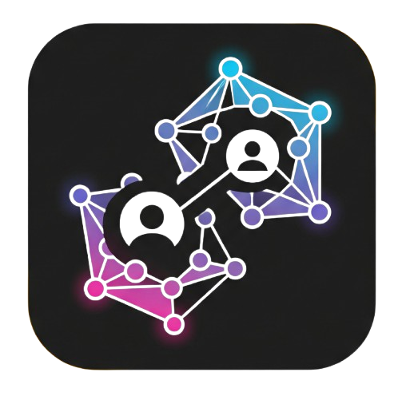

# ContactLi: Libreta de Contactos
<p align="center">
  
</p>

## Tabla de Contenidos

- [Ficha Técnica](#ficha-técnica)
- [Autores](#autores)
- [Requisitos](#requisitos)
- [Instalación](#instalación)
- [Características](#características)
- [DEMO](#demo)
- [Referencias](#referencias)

## Ficha Técnica

- **Nombre del Proyecto:** ContactLi: Libreta de Contactos
- **Descripción:** Aplicación de Escritorio para gestionar contactos.
- **Lenguaje:** Java
- **Framework:** JavaFX
- **Almacenamiento:** Archivos Serializados e imágenes en el sistema de archivos

## Autores
- Geovanny Nieves
- Alexander Soriano
- Leyner Zambrano

## Requisitos

- Java JDK 21
- JavaFX SDK 21
- Maven
- IDE (IntelliJ IDEA)
- Sistema Operativo: Windows 10 o superior
- Conexión a Internet (para descargar dependencias y recursos)
- Git (opcional, para clonar el repositorio)

## Instalación

1. Clonar el repositorio:
   ```bash
   git clone https://github.com/AlexitoSnow/Proyecto_P1_2
    ```
2. Navegar al directorio del proyecto:
3. ```bash
   cd Proyecto_P1_2
   ```
4. Abrir el proyecto en IntelliJ IDEA o cualquier IDE compatible con Java.
5. Asegurarse de que el JDK y JavaFX estén configurados correctamente en el IDE.
6. Compilar el proyecto:
   ```bash
   mvn clean install
   ```
7. Ejecutar la aplicación: Se ha añadido un archivo [Contacts_App.xml](.idea/runConfigurations/Contacts_App.xml)
para facilitar la ejecución de la aplicación desde IntelliJ IDEA. 
   - Si no se utiliza IntelliJ, se puede ejecutar desde la terminal con el siguiente comando:
   ```bash
    javafx:run -f pom.xml
    ```
   - O también desde su IDE favorito, asegurándose de que el JDK y JavaFX estén configurados correctamente.
8. La aplicación se iniciará y podrá comenzar a gestionar sus contactos.

## Características

- **Sesiones de Usuario:** Registro y autenticación de usuarios, cada usuario maneja su libreta de contactos de forma independiente.
- **Gestión de Contactos:** Agregar, editar, eliminar y buscar contactos.
- **Tipos de Contacto:** Persona y Empresa, con atributos específicos para cada tipo.
- **Contactos Favoritos:** Posibilidad de marcar contactos como favoritos para un acceso rápido.
- **Imágenes de Contactos:** Posibilidad de agregar imágenes a los contactos.
- **Foto de Perfil:** Cada contacto puede tener una foto de perfil.
- **Contactos Relacionados:** Posibilidad de agregar contactos relacionados a un contacto específico.
- **Búsqueda Avanzada:** Búsqueda de contactos por atributos del contacto.
  - Criterios de búsqueda avanzada: nombre, apellido, tipo, email, celular, social, dir, notas, fecha, industria.
  - _Nota:_ Se sugiere revisar la guía de usuario dentro de la aplicación para ver un ejemplo de cómo realizar una búsqueda avanzada.
- **Navegación Circular:** Posibilidad de navegar entre contactos de forma circular.
- **Explorador de Imágenes:** Posibilidad de explorar la galería de un contacto de forma circular.

## DEMO

Se ha agregado un usuario con contactos de ejemplo para que se puedan probar las funcionalidades de la aplicación.
Puede iniciar sesión con las siguientes credenciales:

- **Usuario:** `vichucru`
- **Contraseña:** `espolesmipasion`

_Nota_: El usuario no tiene imágenes agregadas, ya que la aplicación guarda la ubicación absoluta de las imágenes en el dispositivo.
Si desea probar la funcionalidad de agregar imágenes, se han agregado imágenes de ejemplo en la carpeta [sample](src/main/resources/assets/images/sample).

## Referencias

- [Philia Contacts](https://apps.microsoft.com/detail/9MXHT996K5ST): Aplicación de Escritorio para gestionar contactos. Nos ayudó a tener una referencia sobre cómo luce una libreta de contactos en el sistema operativo de Windows.
- [WhatsApp Desktop](https://apps.microsoft.com/detail/9NKSQGP7F2NH): Aplicación de mensajería de Escritorio. Nos orientó en la forma en la que se muestran las imágenes y contactos de grupos relacionados.
- [Samsung Contacts](http://apps.samsung.com/appquery/appDetail.as?appId=com.samsung.android.app.contacts): Aplicación móvil para gestionar contactos. Nos ayudó a tener una referencia de cómo se visualizan y editan todos los atributos de un contacto.